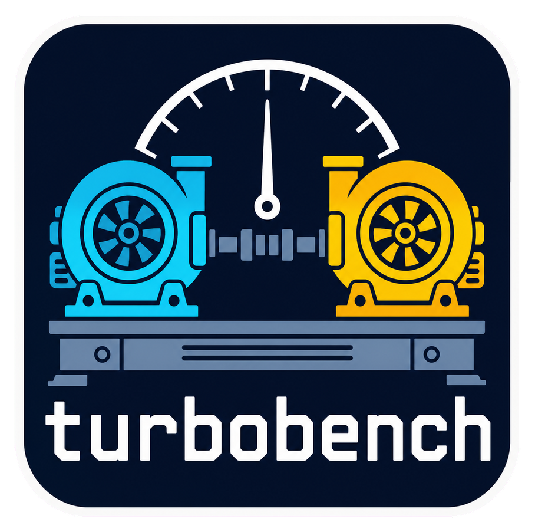
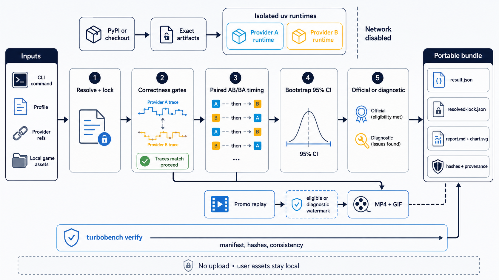

<div align="center">
  

  **⚖️ Matched environments. Measured fairly. ⚖️**
</div>

`turbobench` is a local Python CLI for reinforcement-learning environment authors,
researchers, and provider maintainers who need fair performance comparisons between
compatible implementations. It verifies that two providers produce matching transitions
before timing them, then writes a portable, self-verifying evidence bundle. Run it with a
built-in workload profile and two provider references.

Optional comparison videos replay the same locked providers and semantic action trajectory.
Only valid, conclusive evidence can produce unmarked promotional media; diagnostic output is
clearly watermarked.

## Install

Install [turbobench-cli 2.0.0](https://pypi.org/project/turbobench-cli/2.0.0/)
from PyPI:

```bash
uv tool install turbobench-cli==2.0.0
```

Alternatively, install it in an active virtual environment with
`python -m pip install turbobench-cli==2.0.0`. The installed command and Python
import remain `turbobench`.

For a development checkout:

```bash
git clone https://github.com/tsilva/turbobench.git
cd turbobench
uv sync --frozen --group dev
```

Run `turbobench profiles list` and `turbobench providers list` to choose a
compatible profile and provider pair. Prefix CLI commands with `uv run` when
working from a development checkout.

## Commands

```bash
turbobench doctor vizdoom/basic-v1       # check the host, tools, and profile assets
turbobench profiles list                 # list immutable workloads
turbobench providers list                # list built-in and registered providers

turbobench compare vizdoom/basic-v1 \
  --left env-vizdoom-turbo@1.3.0.post27 \
  --right vizdoom@1.3.0 \
  --output turbobench-results/vizdoom            # create a result bundle

turbobench verify turbobench-results/vizdoom  # verify integrity and consistency
turbobench report turbobench-results/vizdoom  # print the generated report
turbobench promo turbobench-results/vizdoom --diagnostic

uv run --frozen ruff check .                    # lint the project
uv run --frozen pytest -m "not acceptance"      # run tests without proprietary assets
```

Long-running commands write progress to standard error and reserve standard output for their
final machine-readable JSON.

## Notes

- The controller supports Python 3.11 and newer. Provider runtimes default to CPython 3.14.
  `uv`, FFmpeg, and FFprobe are required.
- Built-in profiles cover `supermario/canonical-v1`, `breakout/start-v1`, and
  `vizdoom/basic-v1`. Shapes 1, 16, and 32 are measured and reported independently.
- Provider references accept `provider`, `provider@latest`, `provider@VERSION`, and
  `provider@checkout:/absolute/path`. `latest` excludes prereleases, yanked releases,
  incompatible artifacts, and releases still inside the seven-day quarantine.
- Set `TURBOBENCH_ROM_PATH`, `TURBOBENCH_ASSET_ROOT`, or `RETRO_DATA_PATH` to locate required
  local game payloads. ROMs and local paths are never written to portable bundles; only
  canonical digests are recorded.
- Every official result must pass provider compatibility, matched correctness, system-load,
  alternating paired-measurement, statistical uncertainty, provenance, and asset gates.
  Quick runs and explicit overrides remain diagnostic.
- Turbo providers are preflighted against the normative
  [Turbo Vector API v2 contract](docs/TURBO_VECTOR_API_V2.md). Contract reports
  are hash-bound into result bundles; malformed v2 providers stop before any
  workload, while historical v1 providers remain diagnostic-only.
- Result bundles contain the exact provider lock, shape-local statistics, report, chart, raw
  evidence, verification records, and optional media. `manifest.json` binds every portable
  file by size and SHA-256; turbobench does not upload or publish bundles.
- Official v1 hosts are Apple-silicon macOS and x86-64 Linux. Third-party providers can
  register through the `turbobench.providers` entry-point group.

## Architecture



## License

[MIT](LICENSE)
