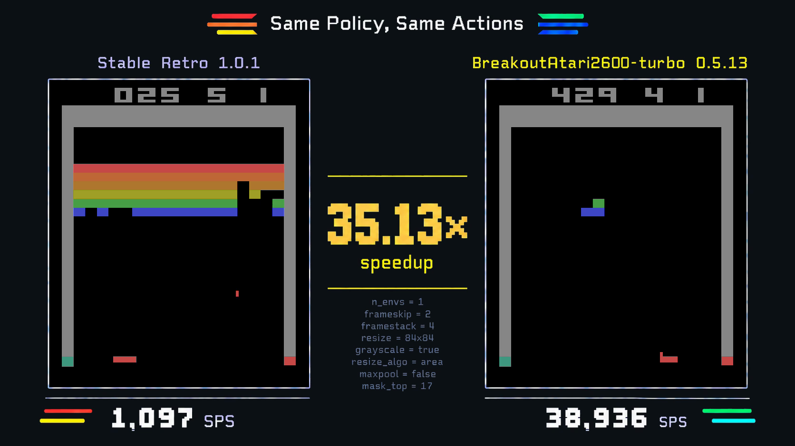

# Comparison media: approved style and constraints

This is the reusable presentation reference for future environment comparisons.
The user approved this style on October 2, 2026. Comparison rendering belongs in
TurboBench; environment repositories receive the finished README assets and
their portable provenance. Read this document before creating comparison media
for another environment.

This image is a historical **design reference**, not an official performance
claim. Its Breakout 0.5.13 / Stable Retro 1.0.1 timings were diagnostic. Its
numbers, versions, policy, and environment settings are examples, never defaults
for another run. Do not publish this fixture as a new benchmark result.

## Presentation

- Use the flat GitHub default dark background, `#0d1117`; gameplay retains its
  canonical background. Avoid gradients, black outer backgrounds, and textures.
- Preserve the arcade pixel typography, restrained panel borders, yellow speed
  emphasis, and small Atari brick-color accents. Adapt gameplay aspect ratios
  with letterboxing and nearest-neighbor scaling; do not distort frames.
- Put the upstream provider on the left and the candidate on the right, with
  exact display names and versions above their panels. Omit the word Original.
  Never relabel whichever provider won as the candidate.
- For new comparisons, use `Same Actions`. That title requires a verified
  common effective action trajectory; policy-backed comparisons also bind the policy;
  other workloads must use an accurate title. Archived frames keep their original title.
  Leave a small visible gap between the title and both brick accents.
- Put the candidate/upstream ratio in the center, with `speedup` directly below
  the multiplier, separated by a small gap. The
  bottom of each panel shows its measured SPS, with the unit immediately beside
  the number regardless of its digit count. Keep the divider and settings close
  below the speedup label, without the former large empty gap. Read all numbers from verified
  evidence; do not bake them into the artwork or ask image generation to draw
  changing data. If the candidate is slower, show the real sub-1× ratio.
- Stack settings vertically below the speedup. Use small, subdued slate text
  (reference `#606975`, approximately 16 px at full size), roughly 25 px row
  spacing, and one fact per line with `=` separators. Include `n_envs`,
  `frameskip`, `framestack`, resize dimensions, grayscale, resize algorithm,
  max pooling, and applicable crop/mask settings. Do not show a Benchmark
  heading or a separate replay-frameskip label. Adapt fields to the environment;
  never invent Atari-specific preprocessing for another game.
- Keep the approved frame free of extra policy/training subtitles, timing
  explanations, and footnotes. Put method, hardware, uncertainty, policy link,
  exclusions, and limitations in the adjacent README caption and method report.
  Unmarked showcase assets still require TurboBench's official validity gates.
  Diagnostic renders must follow TurboBench's diagnostic marking rules; the
  historical user-approved exception is not a general exception for future runs.

## Scaling chart

Use two side-by-side bars for each measured `n_envs`, with upstream on the left
and candidate on the right. Bar heights show each provider's shape-local median
SPS on one shared linear axis starting at zero. Allocate enough canvas width for
legible labels and confidence intervals as adaptive sweeps add counts. Label the exact provider versions
and throughput values. Keep the paired candidate/upstream speedup and its 95%
confidence interval below each group when available; smoke charts disclose the
single sample and absent confidence interval. Keep diagnostic charts visibly
marked, including when the candidate is slower. Never aggregate counts or add
unmeasured environment counts. This chart presentation is `comparison-style/v2`;
archived `comparison-style/v1` point charts retain their original verification.
New frames use `comparison-style/v3` for the `Same Actions` title and adjacent
speedup label; their grouped bar charts are unchanged from v2. Archived v1/v2
frames retain their original title and label placement during verification.
New frames use `comparison-style/v4` for the small title-accent gaps, compact
speedup-to-settings spacing, and number-adjacent SPS units. Archived v3 frames
retain their original geometry during verification; charts remain unchanged.

### README view

The GitHub README uses a separate, readable publication view rather than scaling
the complete wide chart down to fit. Use an 800-unit canvas with side-by-side
vertical bars, a compact height (376 units for up to seven official counts), and readable
SPS and speedup labels. Put the provider legend at the top right, with 14-unit
legend text; use 13-unit SPS and speedup values and 14-unit environment counts.
Keep the gap above the plot small. Below the subtitle, show a 12-unit benchmark
CPU line from the verified result's host hardware; never substitute the rendering
machine's processor. Reserve extra header space only for diagnostic marking.
Both providers share one linear scale from zero; do not enlarge tiny upstream bars
or use undisclosed independent scales. Keep up to seven groups per row; use
additional compact rows for larger sweeps rather than one tall row per count.
Round displayed SPS to whole steps per second, while keeping bar lengths based on
the original medians. Omit paired CI labels and bottom explanatory labels from
publication charts; retain exact values, intervals, sampling and cutoff disclosures
in the adjacent caption and method report. The complete publication view follows
the same label rules and can be exported with `--full`. Archived proof charts
keep their original bytes and verification.

Show the measured prefix through the first maximum candidate median SPS. This
cutoff concerns candidate throughput, not the speedup ratio; retain earlier counts
even if they dip before a later recovery. Disclose the peak and omitted later counts
next to the chart. Keep every measured count in the original proof, complete chart,
and method report. This view is a derived publication export, not a replacement proof.
Generate it with `python -m turbobench.readme_chart BENCHMARK_PROOF OUTPUT.svg`;
the exporter verifies the input and writes an adjacent JSON provenance file binding
the proof ID, result hash, renderer hash, count selection and output digest. Pin the
renderer revision in the environment repository and check the actual GitHub rendering
at README width; readers must not need to open another page to read the values.

## Policy and replay

The policy's saved resolved recipe and training contract are authoritative for
playback. Lock frame skip, frame stack, crop/mask, resizing, grayscale, pooling,
sticky actions, action mapping, reset/serve behavior, policy inputs, and wrapper
semantics. Missing metadata or a mismatch must stop dependent work. Training and
playback frame skip must always match; raw-frame recording may expand each
decision into the trained number of actions without changing that cadence.

Record the checkpoint digest, training run/link, sampling mode and temperature,
seed, selected attempt, requested decisions, and effective actions including
serve overrides. Verify both providers' frames and transition semantics for the
exact excerpt. A partial matching excerpt must be identified as partial, and any
full-episode failure must remain disclosed. Do not imply a completed wall or a
success rate from an excerpt or a single successful episode.

The video illustrates measured environment throughput by compressing both
timelines by a common factor and applying the measured shape-1 ratio to the
candidate. It is not a wall-clock screen recording. The faster panel holds its
last frame; both panels include a two-second end hold. Inference, capture,
rendering, and encoding are excluded unless a separately declared benchmark
explicitly measures them. Deliberate differences between the benchmark and
training pipeline, such as buffer ownership, threads, or excluded wrappers,
must be recorded and disclosed.

## Export and verification

The reference is 1672×940. Export a silent H.264 MP4 at 60 fps and a full-size
lossless animated WebP at 20 fps, looping indefinitely. Display the WebP at
800 CSS pixels in the README, with the MP4 linked and GIF fallback if requested.
Do not downscale the primary animation to 640 px. For a different canvas size,
keep at least twice the intended README display width.

The successful reference WebP conversion decoded the MP4 with FFmpeg's
`fps=20`, then encoded frames with libwebp 1.6.0 `img2webp`, using `-loop 0
-lossless -q 75 -m 6 -d 50`. The 533 input frames totalled 26.65 seconds; the
encoder coalesced one duplicate into 532 stored frames. This is a reproducible
encoding example, not a requirement for every video's duration or frame count.

Verify dimensions, frame durations, infinite looping, lossless decoded-frame
agreement, provider/action bindings, and every output digest. Preserve provenance
when deriving previews from an existing MP4. Check GitHub's rendered Markdown
and actual browser playback, including intrinsic image size versus display size.

The October 2 reference came from native repo commit `e8a1376`, with provenance
in its `demo-manifest.json`. Its MP4 SHA-256 is
`523589ec390d1e100b2f33dd07ab4253c79f3a33f10964b755f45ffc3df95b62`;
its selected policy SHA-256 is
`dcfd8a41bcc7426ac0ef2f108d07a20f2ffb2c0c22745e6690c6065c01d5935a`.
Its MLflow run is
[FirstWall PPO](https://mlflow-beast3.tsilva.eu/#/experiments/6/runs/e10b9f9dfec247b881d2eac3979dda37).

See [the implemented workflow](comparison-workflow.md) for remote benchmarks
and versioned proof packages. The reusable renderer uses the bundled SIL OFL
Press Start 2P font; its license ships beside the font in `src/turbobench/fonts`.
