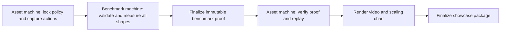

> Implemented workflow and supported commands: [comparison-workflow.md](comparison-workflow.md). This document records the original design proposal; its illustrative CLI/layout is not the command reference.

# One-command comparison evidence and showcase workflow

Design proposal, October 2, 2026. The remote coordinator, policy proof schema,
and new renderer described here are not implemented yet.

## Intended outcome

One user command produces verified benchmark evidence, a locked policy package,
a shape-1 comparison MP4/WebP in the [approved style](comparison-media.md), and
a chart of candidate/upstream speedup across vector shapes. Benchmark timing
runs on a different machine from asset generation. The coordinator returns only
after checking the delivered evidence and assets, or reports a partial failure
while retaining completed evidence for retry.

Proposed interface, **not an existing command**:

```bash
turbobench compare <immutable-profile> \
  --left <upstream-release> --right <candidate-release> \
  --policy <locked-policy-package> \
  --benchmark-host <ssh-host> \
  --render-host local --showcase \
  --output turbobench-results/<comparison>
```

Keep `compare`, `promo`, and `verify` useful independently. A showcase request
orchestrates their phases; it does not make canonical parity an implicit
requirement. Existing compatible parity receipts can still be reused.

## Smoke mode

Add `--smoke` to the same proposed command to check that the complete workflow
works before spending time on an official comparison. This flag is a planned
capability, not an implemented CLI option yet.

- Measure only `n_envs=1` and `n_envs=2`. At each shape run each provider once:
  one paired measurement, one timed repetition per provider, no timing warmups,
  and no additional statistical measurement passes. This is four timed provider
  executions in total. Contract checks and correctness/replay run separately
  and are not additional benchmark measurements.
- Keep the selected policy's training configuration unchanged. Smoke mode
  changes the measurement schedule, never frame skip or preprocessing. Use the
  profile's declared step count for each timed execution; do not silently
  shorten it or select a different policy/trajectory.
- Exercise policy/checkpoint import, both host roles, remote contract validation
  and correctness, timing, proof finalization and transfer, local proof/replay
  verification, video/WebP/chart encoding, and final output verification. Keep
  the requirement for distinct benchmark and asset machines.
- Generate visibly marked diagnostic sample assets, including the shape-1
  video and a chart containing the two measured shapes. Record single-sample
  throughput, but no confidence interval, significance conclusion, or official
  performance claim. Smoke is never promotable, even when every workflow stage
  succeeds. Do not fabricate extra samples to fit existing statistics code.
- Record `mode=smoke`, shape counts, measured-pair count, repetition count, and
  warmup count in the request and proof. Show `pipeline_passed` independently
  from performance validity. Successful verified completion of all requested
  stages exits zero; any real contract, correctness, transport, replay,
  encoding, or verification failure exits nonzero with its stage identified.
  Expected lack of official sample-design evidence is not a pipeline failure.
- Reject contradictory shape/pair/repetition overrides instead of allowing a
  command that says smoke while running a different measurement schedule.
  Keep smoke evidence and resume identities distinct from full-run evidence.

The existing `--quick` mode is not a substitute: it measures shape 1 with the
profile's light pair count, and timed invocations contain three repetitions.
The current statistics/report/media code assumes confidence intervals and
three-repetition invocation medians. Implement smoke-specific diagnostic
statistics and presentation handling without weakening official measurement
or legacy proof validation.

## Existing foundations and gaps

`cli.py` already supports `compare --promo` and separate `promo`/`verify`
commands. `engine.py` performs phase-isolated contract validation, correctness,
paired timing, and replay. `bundle.py` binds portable files by digest and checks
evidence consistency. Current public schemas include `turbobench.manifest/v1`,
`turbobench.result/v2`, `turbobench.resolved-lock/v2`, and
`turbobench.media/v1`.

The current generic renderer uses a different 1280×720 card and 640 px GIF.
The approved policy renderer is an ignored, Breakout-specific script under
`turbobench-results/breakout-trained-policy-20261002/`. It is not a reusable
product feature. The new policy-cadence guard in `policy.py` checks frame skip
and expanded actions; it does not yet validate the full training contract.

`reporting.py` has per-shape SPS bars but no speedup-versus-lane-count plot.
Profiles currently declare shapes 1, 16, and 32. Supplying `--shapes` is a
diagnostic override; adding a denser official sweep requires a new immutable
profile, not silently changing an existing profile. Policy metadata likewise
must match the selected official profile or require a new profile version.

`generate_promo_for_bundle` currently rewrites the source bundle and changes its
bundle ID. The new flow should leave benchmark evidence immutable and bind
subsequent derived assets to it through a separate manifest.

The existing bundle requires `report.md` and `chart.svg`, and the engine always
generates them before finalization. Strict separation therefore also needs a
measurement-only proof format and a deferred reporting phase; merely running
today's `compare` over SSH would still generate an asset on the benchmark host.

## Two-machine execution



1. On the asset machine, import an exact checkpoint and its resolved training
   recipe through the training tool's verified loader. Capture actions once,
   outside timing, retaining sampling provenance and effective overrides.
   Materialize the matched per-lane workload and reset schedule for each shape;
   do not invoke policy inference inside environment-throughput timing.
2. Create a versioned input request binding the profile, provider releases,
   policy/recipe/action hashes, shape schedule, and tool identity. Transport it
   to the benchmark machine and validate it there. Private game assets remain
   host-local; portable proof records only their canonical digests.
3. Resolve exact benchmark-platform artifacts and dependencies. Preflight every
   execution configuration, run correctness, then the existing warmup,
   alternating paired measurement, uncertainty, order, and host-load gates.
   Capture canonical replay hashes and transitions in separate, untimed
   processes. No charts or video encoding run on this machine.
4. Finalize and verify the benchmark proof before transfer. Record the measured
   host, timing boundaries, thread/affinity and buffer settings, artifacts,
   raw samples, exclusions, and all failed or overridden gates.
5. On the asset machine, verify the received proof against the input request;
   replay the bound action stream and validate it against remote frame and
   transition commitments before generating media. Render the chart solely
   from recorded shape statistics. Never rerun timing to fill missing data.
6. Finalize a separately identified showcase package referencing the immutable
   benchmark, policy, replay, template, and output hashes. Resume rendering
   from a verified benchmark without changing its bytes or ID.

Enforce distinct host identities rather than trusting different SSH aliases or
identical hardware descriptions. Record the attested host roles with private
machine identifiers redacted; this is a provenance gate, not protection against
a malicious runner fabricating evidence.

Cross-platform rendering needs two explicit runtime locks. Linux and macOS
wheels have different bytes; do not claim the renderer used the benchmark wheel.
Require pinned release/source identity, corresponding artifact digests, and
agreement with the benchmark-host replay commitments. If a matching render
runtime cannot reproduce those commitments, retain the proof and stop media
generation. Do not fall back to an unpinned current checkout.

## Policy package

Record model file inventory and digest, framework/loader and dependency lock,
training run ID and URL, checkpoint step/kind, resolved recipe and wrapper
contract, observation/action schemas, stochastic or deterministic evaluation
settings, capture seed/attempt, effective action stream, and reset schedule.

Recommended default: include the exact checkpoint bytes in the generated proof
package when redistribution is authorized. This means the result directory or
archive, not the TurboBench Git repository or Python distribution. A training
run URL is useful provenance but cannot replace a checkpoint digest or bytes.
If bytes cannot be included, record an immutable digest-addressed external
reference and explicitly classify the package as requiring an external model;
verification must not describe it as fully self-contained.

Playback must match the whole saved training contract. Benchmark pixel/action
settings must match that contract; lane count varies by design. Record deliberate
timing-workload differences such as excluded inference, context construction,
task shaping, buffer ownership, or thread configuration. Never call an
environment-only result full policy-pipeline performance.

## Proposed proof contracts

Keep existing benchmark evidence readable. Add published, machine-validated
schemas and semantic validators rather than relying on ad hoc JSON fields:

| Proposed schema | Binds |
| --- | --- |
| `turbobench.comparison-request/v1` | Exact profile, provider selection, policy, actions, host roles, expected outputs |
| `turbobench.policy-proof/v1` | Model inventory, recipe, loader, training provenance, capture and action contract |
| `turbobench.benchmark-proof/v1` | Measurement-only core evidence, exact runtime lock, samples, gates, host and untimed replay commitments |
| `turbobench.showcase-proof/v1` | Immutable benchmark and policy IDs, remote/local replay attestations, template/renderer version, outputs |

The new measurement-only manifest remains a content-addressed child proof; the showcase
ID is derived from its own canonical manifest with its ID field omitted. Hash
links form a directed acyclic graph, avoiding circular media/bundle IDs.
Its required files exclude presentation assets. Preserve verification of legacy
bundles that require a report/chart; do not weaken their existing validators.

Reject unsupported schema versions, missing required data, unsafe/duplicate
paths, hash mismatches, and broken semantic bindings. Breaking contract changes
require a new version and explicit compatibility handling. Retain schema
documents/identities with portable evidence and provide one `verify` entry point
that dispatches to the correct version. Round trips, unknown versions, tampered
weights/recipes/actions, host-role reuse, mismatched shapes, and asset replacement
need meaningful rejection tests.
The schemas must also represent smoke sampling and absent uncertainty
explicitly; a one-sample ratio must never be interpreted as a conclusive
performance result.

Hash verification proves integrity and internal consistency, not that a human
or machine reported truthful timings. Reports should preserve that distinction.
A runner signature/attestation can establish origin if public verification needs
it; rerunning the locked workload remains the empirical replication path.

## Deliverables and chart

```text
comparison/
  showcase-manifest.json
  benchmark/                   # immutable measurement proof and raw samples
  policy/                      # proof, recipe, loader lock, checkpoint if allowed
  replay/                      # actions, transitions, hashes, cross-host checks
  media/
    comparison.mp4
    comparison.webp
    scaling.svg
    scaling.png
    media-manifest.json
  README-snippet.md             # embeds, method caption, proof links
  report.md                    # generated on the asset machine
```

The primary chart plots candidate/upstream paired speedup and 95% confidence
interval against `n_envs`, with a 1× reference line and explicit measured lane
counts. Match the frame's dark background and yellow emphasis. Offer absolute
SPS in an accompanying plot/table. Do not aggregate different shapes, omit slow
or inconclusive results, assume monotonic scaling, or extrapolate unmeasured
points. Hardware and fixed workload/thread settings belong in the chart caption.
Inconclusive points remain visible with their uncertainty. A standalone chart
can still be produced when the shape-1 video is ineligible.

Unmarked promotional video requires a valid, conclusive shape-1 benchmark and
exact replay. Failed gates preserve evidence and refusal reasons; explicit
diagnostic rendering stays visibly diagnostic. Nothing is published or uploaded
automatically. Success requires verified proof plus requested assets; a render
failure must not be presented as overall showcase success.

## Implementation order

1. Formalize policy imports and full training-contract validation; define and
   test the versioned request/policy/showcase schemas and immutable proof links.
2. Extract the approved deterministic presentation into `promo.py`, with
   full-resolution WebP and a scaling chart in `reporting.py`.
3. Add remote coordination and host-role/cross-platform evidence checks, while
   preserving phase isolation and independent compare/promo/verify operations.
4. Validate the complete flow with fake providers, then a fresh real official
   policy-compatible profile on an idle benchmark machine and a separate asset
   machine. Keep model checkpoints and benchmark outputs ignored by Git.
   Include a `--smoke` integration test that verifies exactly one timed execution
   per provider at each of shapes 1 and 2, generates diagnostic assets, and
   propagates failures from every dependent stage. Ensure smoke cannot be
   promoted or silently reused as full-run evidence.

## Approved persistent intent

The user approved implementation of this proposal. These bullets are recorded in root SPECS.md:

- Provide one comparison workflow that produces portable benchmark evidence, a policy-backed `n_envs=1` comparison video, and a speedup chart across the profile's declared environment counts.
- Performance measurements must run on a different machine from showcase asset generation, with both host roles bound into the portable evidence.
- Policy-backed comparison evidence must lock the exact checkpoint and saved training configuration; playback must match that training contract, and deliberate benchmark workload differences must be disclosed.
- Proof packages must use versioned, machine-verifiable schemas that bind benchmark evidence, policy provenance, replay evidence, and every derived showcase asset.

Proposed project skill: `comparison-showcase`, located at
`.codex/skills/comparison-showcase/SKILL.md`. It would route future requests to
the approved style and this workflow document, require locked policy metadata
and verified evidence before rendering, keep comparison logic in TurboBench,
and verify full-resolution README assets. Its agent instructions would clearly
distinguish the existing commands from this proposed remote workflow. The skill is now created and registered in AGENTS.md.
